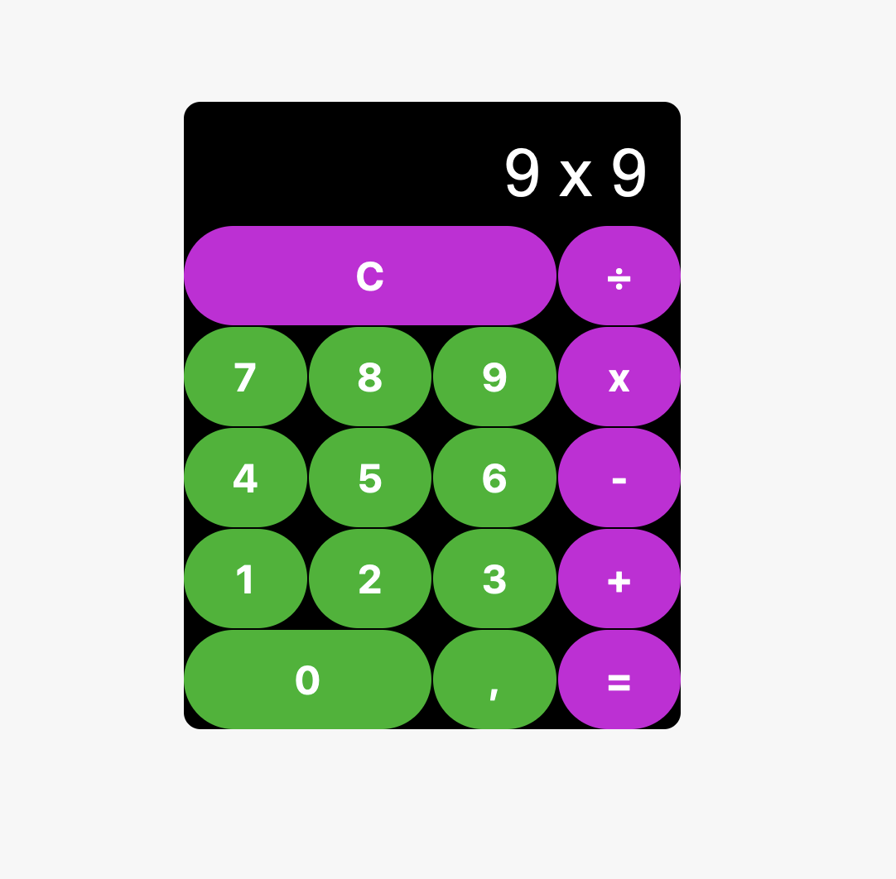

# Projeto "Calculadora"

O projeto foi desenvolvido como forma de prática dos conceitos básicos de HTML, CSS, JavaScript e Lógica de Programação

### Acesse o projeto em funcionamento pelo link: https://isaias30silva.github.io/CALCULADORA_JAVASCRIPT/
